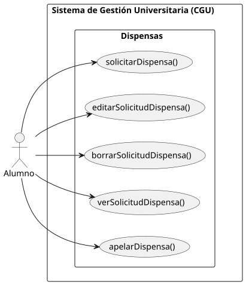

# 👤 Casos de Uso — Alumno

|          |
| ------------------------------------------------------------------------------------------------------------------------------------------------------------------------------------------------------------------------------------------------------------------------------------------------------------------------------------------------------------------------------------------------------------------------------------------------------------------------------------------------------------------------------------------------------------------------------------------------------------------------------------------------------------------------------------------------------------------------------------------------------------------------------------------------------------------------------------------------------------------------------------------------------------------------------------------------------------------------------------------------------------------------------------------------------------------------------------------------------------------------------: |

---

## 👤 Diagrama de Casos de Uso - Alumno

📁 [Carpeta](.) | 📄 [SVG](./DdCdU.svg) | 📋 [PUML](./DdCdU.puml)

---

> ✨ *Este diagrama define las interacciones específicas del Alumno con el sistema, asegurando que todas sus funcionalidades sean claras y alineadas con los requisitos del negocio.*
