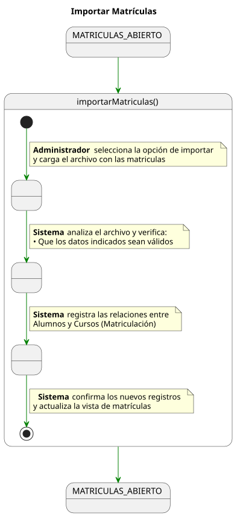
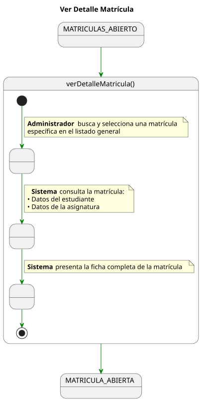
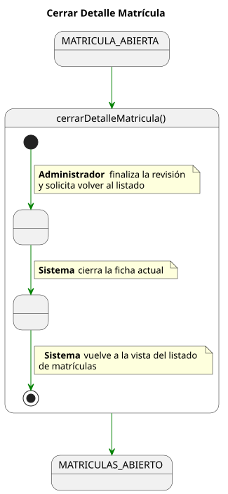

# Detallado Casos De Uso Administrador

## Gestión de Usuarios

📄 [SVG](./crearUsuario.svg) | 📋 [PUML](./crearUsuario.puml)

📄 [SVG](./consultarUsuario.svg) | 📋 [PUML](./consultarUsuario.puml)

📄 [SVG](./editarUsuario.svg) | 📋 [PUML](./editarUsuario.puml)

📄 [SVG](./guardarUsuario.svg) | 📋 [PUML](./guardarUsuario.puml)

📄 [SVG](./cerrarUsuario.svg) | 📋 [PUML](./cerrarUsuario.puml)

## Gestión de Matrículas

📄 [SVG](./importarMatriculas.svg) | 📋 [PUML](./importarMatriculas.puml)

📄 [SVG](./verDetalleMatricula.svg) | 📋 [PUML](./verDetalleMatricula.puml)

📄 [SVG](./cerrarDetalleMatricula.svg) | 📋 [PUML](./cerrarDetalleMatricula.puml)
