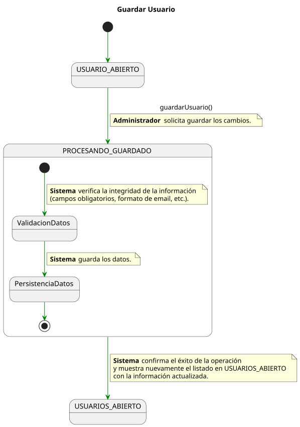

# Detallado Casos de Uso Administrador

## Usuarios

### Crear Usuario

  

   

### Consultar Usuario

  

   

### Editar Usuario

  

   

### Guardar Usuario

  

   

### Cerrar Usuario

  

   
