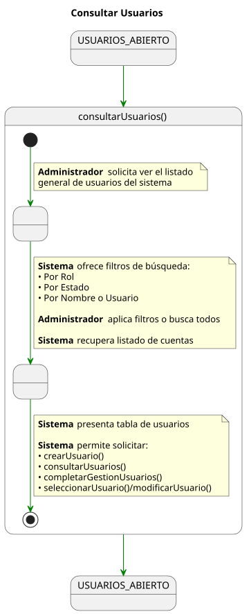
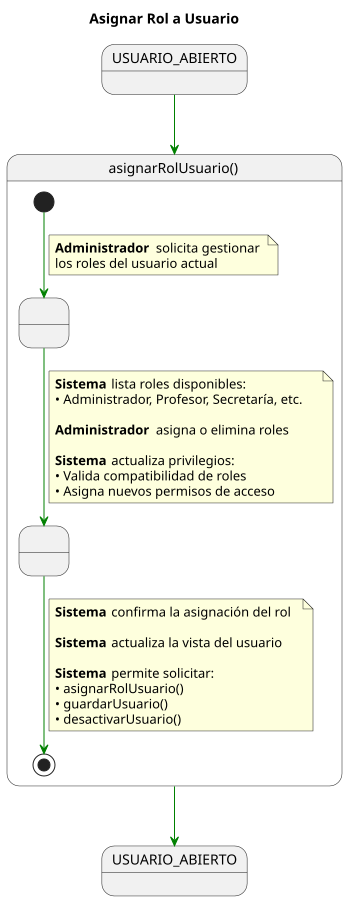
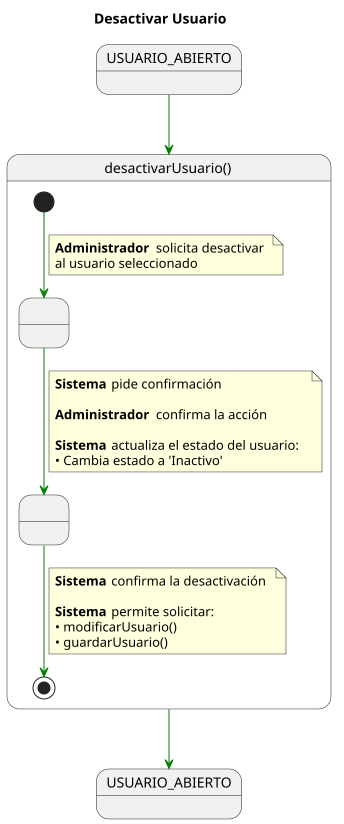
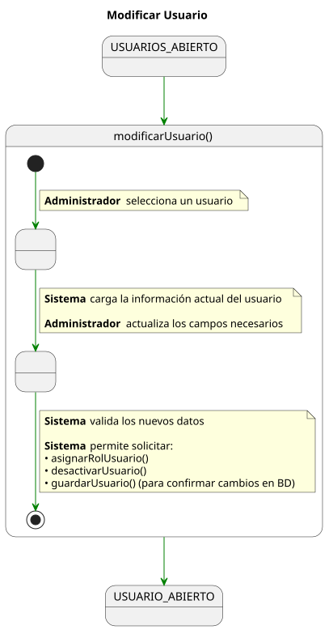

# Detallado Casos De Uso Administrador

## Gestión de usuarios y roles

📄 [SVG](./consultarUsuarios.svg) | 📋 [PUML](./consultarUsuarios.puml)

📄 [SVG](./asignarRolUsuario.svg) | 📋 [PUML](./asignarRolUsuario.puml)

📄 [SVG](./desactivarUsuario.svg) | 📋 [PUML](./desactivarUsuario.puml)

📄 [SVG](./modificarUsuario.svg) | 📋 [PUML](./modificarUsuario.puml)

📄 [SVG](./crearUsuario.svg) | 📋 [PUML](./crearUsuario.puml)

