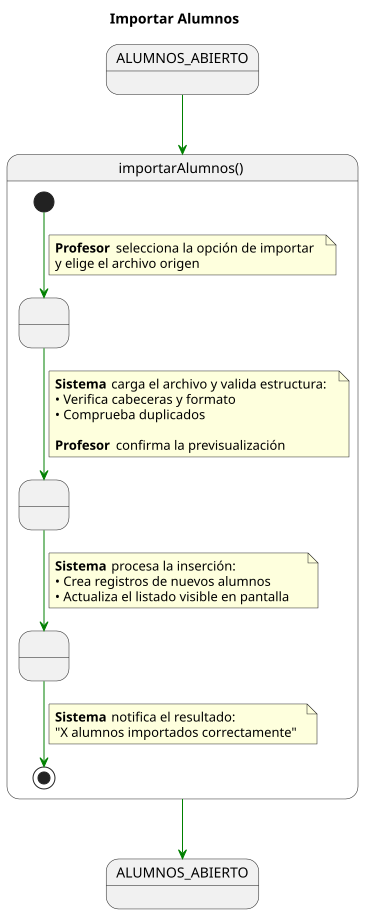
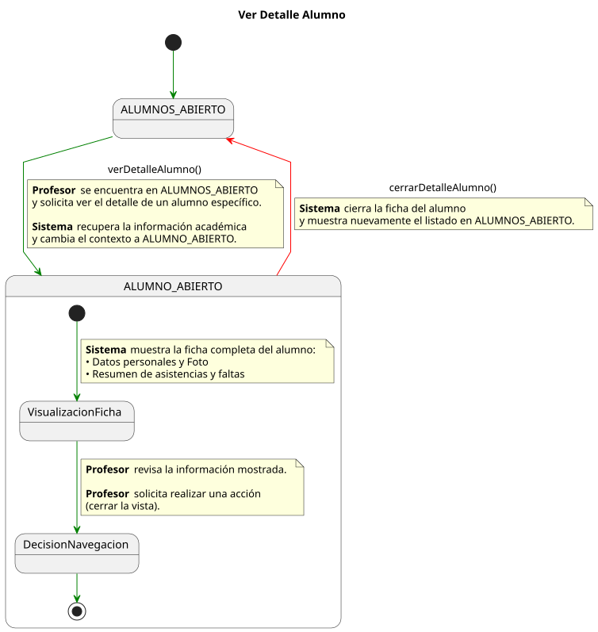

# Detallado Casos De Uso Profesor

## Asistencias

📄 [SVG](./crearSesionClase.svg) | 📋 [PUML](./crearSesionClase.puml)

📄 [SVG](./registrarTomaAsistencia.svg) | 📋 [PUML](./registrarTomaAsistencia.puml)

📄 [SVG](./cerrarSesionClase.svg) | 📋 [PUML](./cerrarSesionClase.puml)

📄 [SVG](./exportarHistorialAsistencias.svg) | 📋 [PUML](./exportarHistorialAsistencias.puml)

## Alumnos

📄 [SVG](./importarAlumnos.svg) | 📋 [PUML](./importarAlumnos.puml)

📄 [SVG](./verDetalleAlumno.svg) | 📋 [PUML](./verDetalleAlumno.puml)

## Dispensas

📄 [SVG](./consultarSolicitudDispensa.svg) | 📋 [PUML](./consultarSolicitudDispensa.puml)

