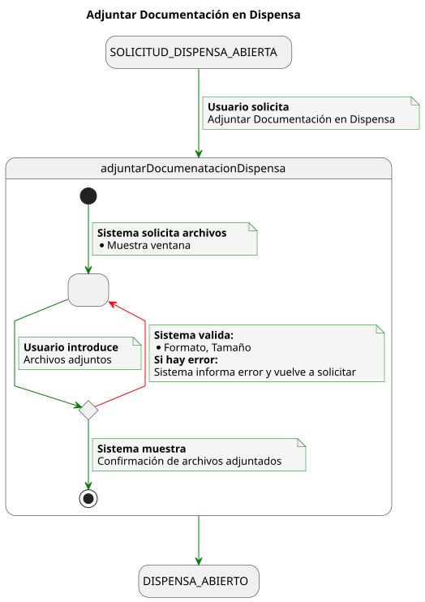
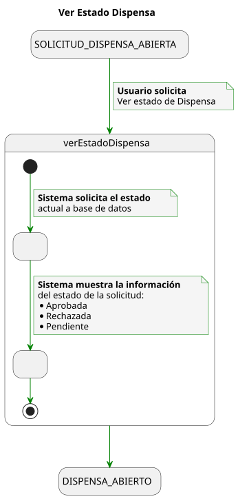
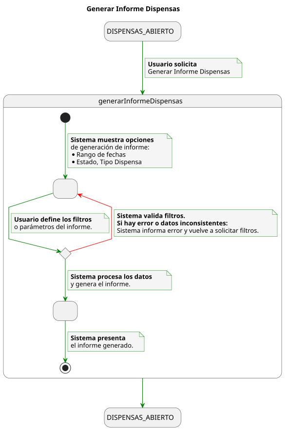
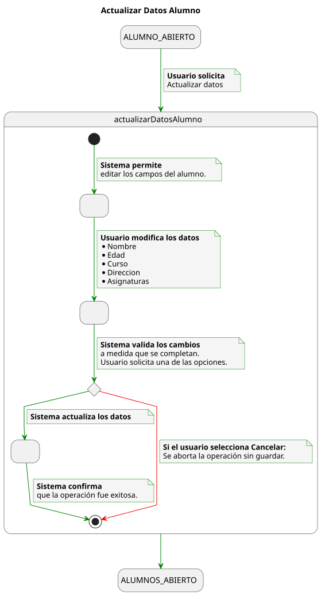
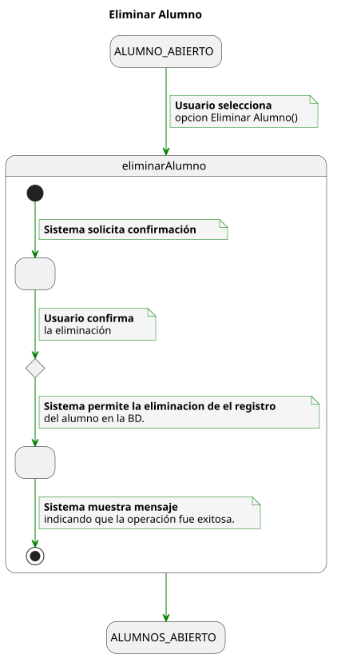
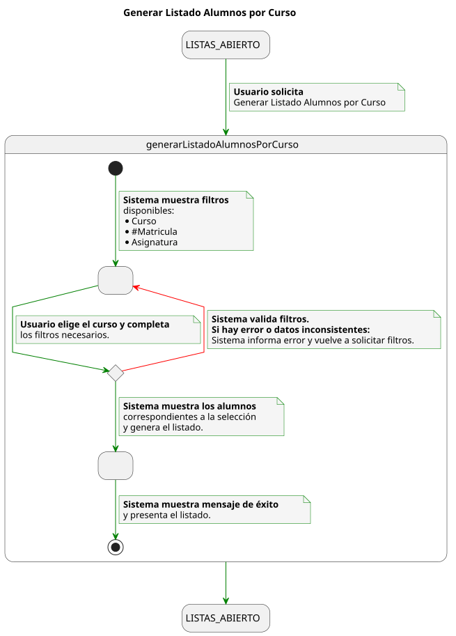
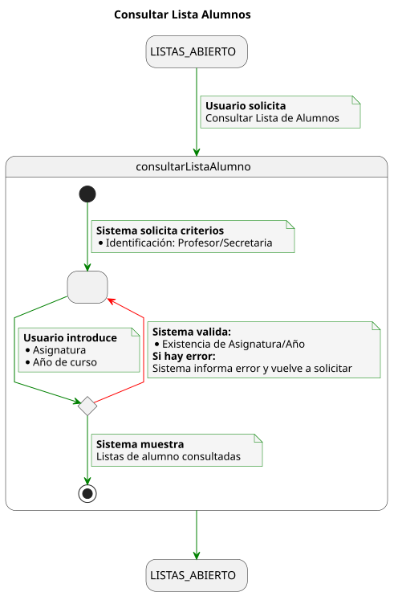

# Detallado Casos de Uso Secretaria

## Dispensa

📄 [SVG](./crearSolicitudDispensa.svg) | 📋 [PUML](./crearSolicitudDispensa.puml)

📄 [SVG](./adjuntarDocumentacionDispensa.svg) | 📋 [PUML](./adjuntarDocumentacionDispensa.puml)

📄 [SVG](./verEstadoDispensa.svg) | 📋 [PUML](./verEstadoDispensa.puml)

📄 [SVG](./generarInformeDispensas.svg) | 📋 [PUML](./generarInformeDispensas.puml)

## Alumnos

📄 [SVG](./actualizarDatosAlumno.svg) | 📋 [PUML](./actualizarDatosAlumnos.puml)

📄 [SVG](./eliminarAlumno.svg) | 📋 [PUML](./eliminarAlumno.puml)

## Listas

📄 [SVG](./generarListadoAlumnosPorCurso.svg) | 📋 [PUML](./generarListadoAlumnosPorCurso.puml)

📄 [SVG](./consultarListaAlumno.svg) | 📋 [PUML](./consultarListaAlumnos.puml)