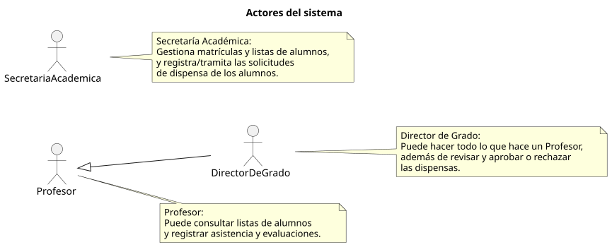

# 🎭 Casos de Uso — Centro de Gestión Universitaria

|          |
| ------------------------------------------------------------------------------------------------------------------------------------------------------------------------------------------------------------------------------------------------------------------------------------------------------------------------------------------------------------------------------------------------------------------------------------------------------------------------------------------------------------------------------------------------------------------------------------------------------------------------------------------------------------------------------------------------------------------------------------------------------------------------------------------------------------------------------------------------------------------------------------------------------------------------------------------------------------------------------------------------------------------------------------------------------------------------------------------------------------------------------: |

---

| Artefacto | Descripción |
|-----------|-------------|
| 👥 [Actores](/documents/CasosDeUso/Actores/) | Define los diferentes tipos de usuarios que interactúan con el sistema. |
| 📄 [Casos de Uso]| ⚠️ **EN PROCESO** Describe las funcionalidades específicas del sistema desde la perspectiva del usuario. |
| 🌐 [Diagrama de Contexto] | ⚠️ **EN PROCESO** Muestra el sistema en relación con su entorno y actores externos. |
| 🧩 [Prototipos]| ⚠️ **EN PROCESO** Interfaces visuales que representan las interacciones del sistema. |

---

## 👥 Actores del Sistema

### 📊 Diagrama de Actores

📁 [Carpeta](./Actores/) | 📄 [SVG](./Actores/Actores.svg) | 📋 [PUML](./Actores/Actores.puml)

---

> ✨ *Los casos de uso definen las interacciones entre los actores y el sistema, asegurando que todas las funcionalidades sean claras, trazables y alineadas con los requisitos del negocio.*