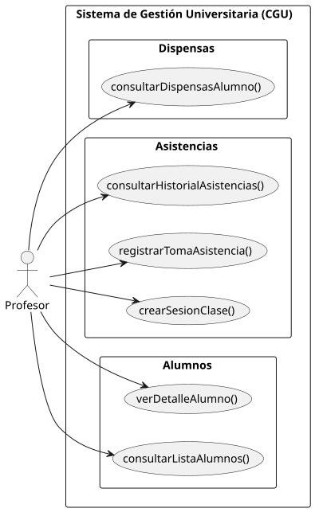
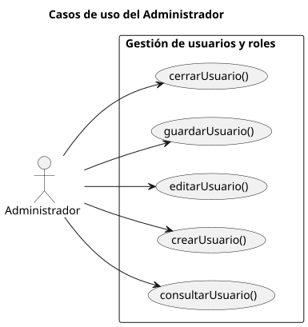
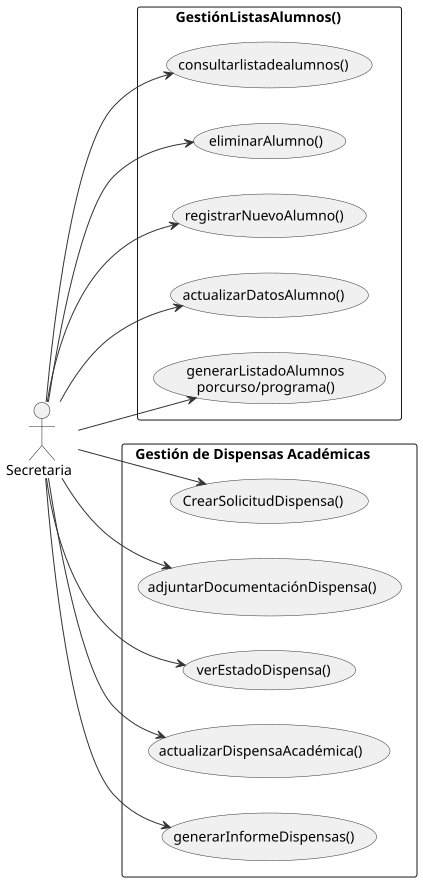

# Casos de Uso

|          |
| ---- |

Descripción de las funcionalidades del sistema por rol de usuario.

---

## Enlaces Rápidos

    

---

## Alumno

  

---

## Profesor

  

---

## Administrador

  

---

## Secretaria

  

---

## Director de Grado

  

---

