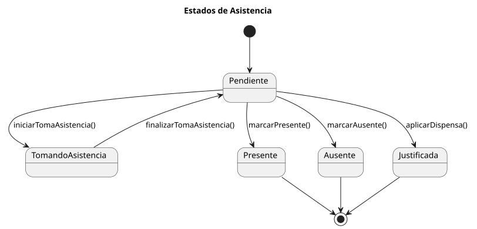
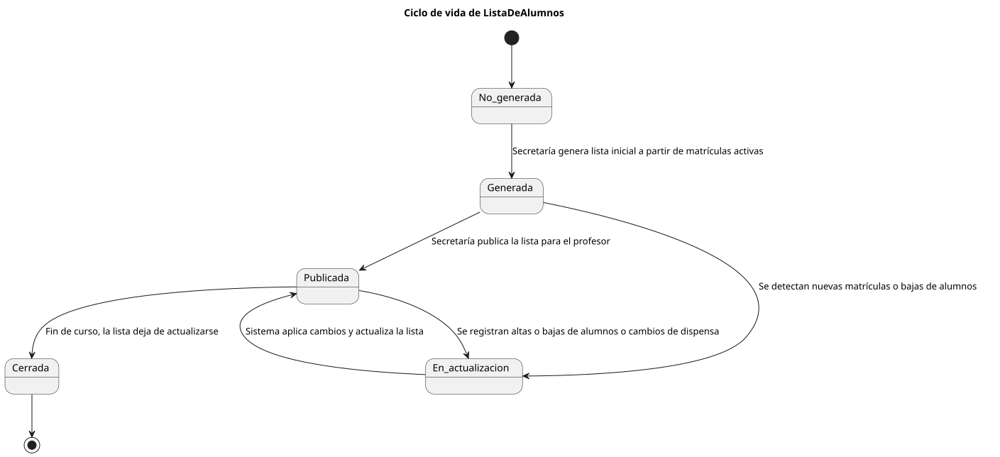

# 🕐 Diagramas de Estado — Centro de Gestión Universitaria

|          |
| ------------------------------------------------------------------------------------------------------------------------------------------------------------------------------------------------------------------------------------------------------------------------------------------------------------------------------------------------------------------------------------------------------------------------------------------------------------------------------------------------------------------------------------------------------------------------------------------------------------------------------------------------------------------------------------------------------------------------------------------------------------------------------------------------------------------------------------------------------------------------------------------------------------------------------------------------------------------------------------------------------------------------------------------------------------------------------------------------------------------------------: |

---

## 🕐 Diagramas de Estado del Sistema

Los diagramas de estado modelan el **ciclo de vida de las entidades principales** del sistema, permitiendo comprender y validar los **comportamientos dinámicos**. Cada diagrama describe los posibles estados por los que puede transitar una entidad y las transiciones permitidas entre ellos.

---

### 👤 Alumno

📁 [Carpeta](./Alumno/) | 📄 [SVG](./Alumno/Alumno.svg) | 📋 [PUML](./Alumno/Alumno.puml)

---

### 📋 Asistencia

📁 [Carpeta](./Asistencia/) | 📄 [SVG](./Asistencia/Asistencia.svg) | 📋 [PUML](./Asistencia/Asistencia.puml)

---

### 🎓 Director de Grado

📁 [Carpeta](./DirectorGrado/) | 📄 [SVG](./DirectorGrado/DirectorGrado.svg) | 📋 [PUML](./DirectorGrado/DirectorGrado.puml)

---

### 🪪 Dispensas

📁 [Carpeta](./Dispensas/) | 📄 [SVG](./Dispensas/Dispensas.svg) | 📋 [PUML](./Dispensas/Dispensas.puml)

---

### 📚 Lista de Alumno

📁 [Carpeta](./ListaAlumno/) | 📄 [SVG](./ListaAlumno/ListaAlumno.svg) | 📋 [PUML](./ListaAlumno/ListaAlumno.puml)

---

### 🎯 Matricula

📁 [Carpeta](./Matricula/) | 📄 [SVG](./Matricula/Matricula.svg) | 📋 [PUML](./Matricula/Matricula.puml)

---

### 🕐 Sesión de Clase

📁 [Carpeta](./SesionDeClase/) | 📄 [SVG](./SesionDeClase/SesionDeClase.svg) | 📋 [PUML](./SesionDeClase/SesionDeClase.puml)

---

> ✨ *Los diagramas de estado son esenciales para comprender la dinámica del sistema, proporcionando una visión clara del comportamiento esperado de cada entidad a lo largo de su ciclo de vida.*
