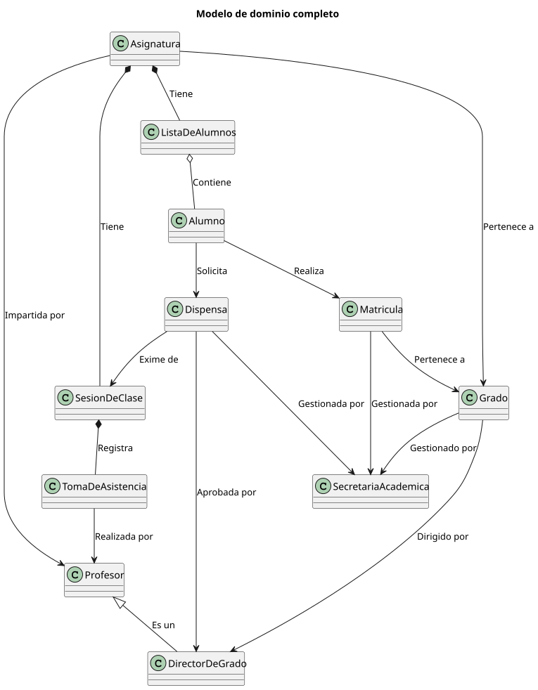

# 🧠 Modelo del Dominio — Sistema de Gestión de Alumnos

## 📚 Contenido del modelo del dominio

| Artefacto | Descripción |
|------------|-------------|
| 🧩 [Diagrama de Clases](/documents/ModeloDelDominio/DiagramasDeClase/) | Representa las entidades del sistema, sus atributos, operaciones y relaciones entre ellas. |
| 🔄 [Diagrama de Estados]() | ⚠️ **EN PROCESO** — Describe los posibles estados de las entidades dinámicas (como Alumno o Dispensa) y las transiciones entre ellos. |
| 🧮 [Diccionario de Clases]() | ⚠️ **EN PROCESO** — Define los atributos y métodos de cada clase con su descripción y tipo de dato.
---

## 🧩 ¿Qué es el Modelo del Dominio?

El **modelo del dominio** es la representación de las **clases conceptuales más importantes del mundo real** en el contexto de nuestra solución. Se centra en **vocabulario, abstracciones relevantes e información del dominio**, actuando como punto de entrada para muchos artefactos que se construyen en un proceso de software.

**Importante:** El modelo del dominio *no es* la representación de las clases del software ni de los objetos. Se expresa en el lenguaje del cliente, no depende de ningún entorno informático y no considera restricciones de implementación.

---

## 🔍 Diagramas de Clases

El **Diagrama de Clases** refleja la estructura estática del sistema. 

Permite visualizar las entidades principales, sus atributos y los vínculos entre ellas.  

Se centra en el **qué existe** en el sistema, no en **cómo se comporta**.

---

### 📋 Diagrama de Clase

📁 [Carpeta](./DiagramasDeClase/) | 📄 [SVG](./DiagramasDeClase/ModeloCompleto.svg) | 📋 [PUML](./DiagramasDeClase/ModeloCompleto.puml)

---

> ✨ *El modelo del dominio constituye la base conceptual del proyecto, garantizando que todos los miembros del equipo compartan una misma comprensión sobre la estructura y funcionamiento del sistema.*
