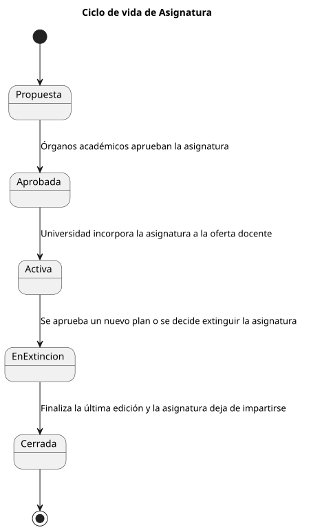
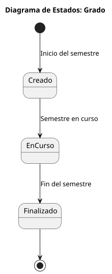
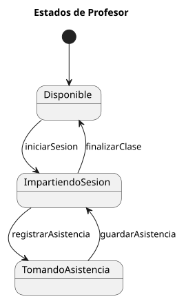

# 🧠 Modelo del Dominio — Sistema de Gestión de Alumnos

## 📚 Contenido del modelo del dominio

| Artefacto | Descripción |
|------------|-------------|
| 🧩 [Diagrama de Clases](/documents/ModeloDelDominio/DiagramasDeClase/) | Representa las entidades del sistema, sus atributos, operaciones y relaciones entre ellas. |
| 🔄 [Diagrama de Estados](/documents/ModeloDelDominio/DiagramasDeEstado/) | Describe los posibles estados de las entidades dinámicas (como Alumno o Dispensa) y las transiciones entre ellos. |
| 🧮 [Diccionario de Clases]() | ⚠️ **EN PROCESO** — Define los atributos y métodos de cada clase con su descripción y tipo de dato.
---

## 🧩 ¿Qué es el Modelo del Dominio?

El **modelo del dominio** es la representación de las **clases conceptuales más importantes del mundo real** en el contexto de nuestra solución. Se centra en **vocabulario, abstracciones relevantes e información del dominio**, actuando como punto de entrada para muchos artefactos que se construyen en un proceso de software.

**Importante:** El modelo del dominio *no es* la representación de las clases del software ni de los objetos. Se expresa en el lenguaje del cliente, no depende de ningún entorno informático y no considera restricciones de implementación.

---

### 📋 Diagrama de Clase

📁 [Carpeta](./DiagramasDeClase/) | 📄 [SVG](./DiagramasDeClase/ModeloCompleto.svg) | 📋 [PUML](./DiagramasDeClase/ModeloCompleto.puml)

---

### 🧑‍🎓 Diagrama de Estado - Alumno

📁 [Carpeta](./DiagramasDeEstado/Alumno/) | 📄 [SVG](./DiagramasDeEstado/Alumno/Alumno.svg) | 📋 [PUML](./DiagramasDeEstado/Alumno/Alumno.puml)

---

### 📚 Diagrama de Estado - Asignatura

📁 [Carpeta](./DiagramasDeEstado/Asignatura/) | 📄 [SVG](./DiagramasDeEstado/Asignatura/Asignatura.svg) | 📋 [PUML](./DiagramasDeEstado/Asignatura/Asignatura.puml)

---

### 📋 Diagrama de Estado - Dispensas

📁 [Carpeta](./DiagramasDeEstado/Dispensas/) | 📄 [SVG](./DiagramasDeEstado/Dispensas/Dispensas.svg) | 📋 [PUML](./DiagramasDeEstado/Dispensas/Dispensas.puml)

---

### 🎓 Diagrama de Estado - Grado

📁 [Carpeta](./DiagramasDeEstado/Grado/) | 📄 [SVG](./DiagramasDeEstado/Grado/Grado.svg) | 📋 [PUML](./DiagramasDeEstado/Grado/Grado.puml)

---

### 📝 Diagrama de Estado - Matrícula

📁 [Carpeta](./DiagramasDeEstado/Matricula/) | 📄 [SVG](./DiagramasDeEstado/Matricula/Matricula.svg) | 📋 [PUML](./DiagramasDeEstado/Matricula/Matricula.puml)

---

### 👨‍🏫 Diagrama de Estado - Profesor

📁 [Carpeta](./DiagramasDeEstado/Profesor/) | 📄 [SVG](./DiagramasDeEstado/Profesor/DdE.svg) | 📋 [PUML](./DiagramasDeEstado/Profesor/DdE.puml)

---

### 🕐 Diagrama de Estado - Sesión de Clase

📁 [Carpeta](./DiagramasDeEstado/SesionDeClase/) | 📄 [SVG](./DiagramasDeEstado/SesionDeClase/DdE.svg) | 📋 [PUML](./DiagramasDeEstado/SesionDeClase/DdE.puml)

> ✨ *El modelo del dominio constituye la base conceptual del proyecto, garantizando que todos los miembros del equipo compartan una misma comprensión sobre la estructura y funcionamiento del sistema.*
